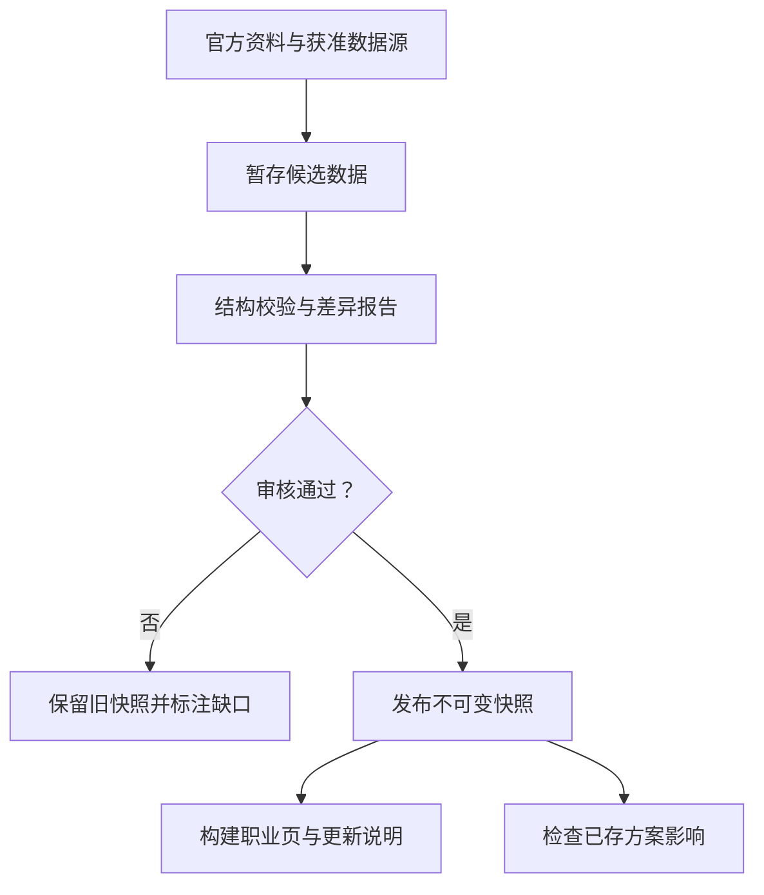
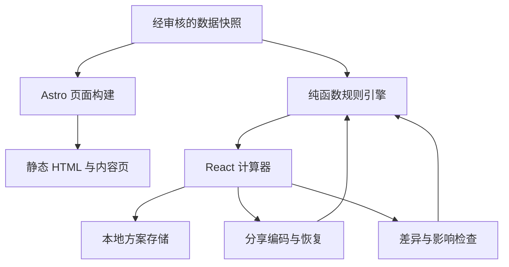

# WoW Forever Talent：调研、需求说明与开发方案

域名：`wowforevertalentcalculator.com`  
文档版本：v1.1 / 2026-09-15  
目标关键词：`wow forever talent`、`wow forever talent calculator`、`wow talent calculator`  
交付范围：公开资料调研、竞品分析、SEO 策略、产品需求、数据与技术方案、实施计划、验收标准。本文未包含已开发或已部署的网站。

## 1. 项目判断与推荐方向

**建议做一个聚焦 WoW Forever 的轻量天赋规划工具，重点解决“配点、对比、分享，以及版本更新后重新检查方案”四件事。**

这个项目具备新版本发布前的内容窗口，但已经不是空白市场。Wowhead、WOWTBC、Icy Veins，以及多个独立站已有 Forever 计算器。仅仅把传统天赋树搬到新域名，难以形成持续优势。

推荐定位：**A fast WoW Forever talent planner to build, compare, and revisit your setups as talents change.**

产品主张由四部分组成：

1. 基础体验可靠：九职业、准确配点、手机可用、免登录保存与分享。
2. 方案比较直接：同职业 A/B 配点差异和已选天赋说明，不包装成未经验证的 DPS 评分。
3. 更新影响清楚：告知用户“这次更新涉及你的哪些天赋”，保留旧方案与当时的数据。
4. 数据状态透明：分清官方说明、客户端核实、社区抄录、来源估算与未知内容。

英文为首发主语言，简体中文界面与术语架构同步建设，中文内容经过校对后开放索引。首发不扩展装备模拟、全职业攻略社区、账号体系、AI 自动配点或付费订阅。

### 1.1 方案取舍

| 方向 | 优点 | 主要代价 | 决策 |
| --- | --- | --- | --- |
| 纯天赋计算器 | 实现快、范围小 | 同质化明显，用户离站后缺少回来理由 | 作为基础层 |
| 计算器 + 方案对比 + 更新影响 | 贴合版本变化期，能形成持续使用场景 | 需要快照、稳定 ID、差异与兼容机制 | **推荐主方向** |
| 综合 Forever 数据库与攻略社区 | 内容空间大 | 采编、审核、维护及竞争成本高 | 后续按实际需求扩展 |

这些属于本项目的产品判断，不代表已经用流量或用户访谈验证的市场结论。

## 2. 调研方法与证据边界

调研日为 2026-09-15。优先采用暴雪公告，其次是竞品自己的页面、公开数据说明及浏览器可见界面。

本次完成：

- 阅读暴雪 Forever 公告和 Deep Dive 总结，核查中国官网展示的国服日期。
- 阅读用户指定的三个竞品；在浏览器打开它们的计算器页面。
- 对 `wowforevertalent.com` 实际执行一次加点、一次右键退点，确认分享字段随配点变化。
- 在 Wowhead 页面确认天赋树、剩余点数、树重置、Talent Order 及预览数据说明。
- 在 WOWTBC 的法师页确认三棵树、分享、重置、51 点预算和导航里的 Coming soon 状态。
- 找到 Talents Forever 公布的 JSON，检查元数据与部分职业字段；核查其授权声明。

本次未完成：全部职业逐节点与客户端比对、全部竞品手机实机测试、跨浏览器全流程测试、搜索量与外链规模测量、全量 JSON 本地导入。JSON 可由网页工具读取，但本地下载请求返回 403，因此本文不宣称已完成数据抓取管线验证。

“页面可见入口”“站方声明”“实际操作验证”是不同证据级别。未看到某项功能，不能证明竞品完全没有这项功能。下文给出的优先级、工时及指标均为规划值。

## 3. 游戏资料及其产品影响

### 3.1 WoW Forever 是什么

暴雪把 World of Warcraft: Forever 定位为与现代版及经典版并列的长期世界，以原始艾泽拉斯与 1–60 级旅程为基础持续扩展。它不是将 TBC、SoD 或现代版天赋换一个名称。英文官网公告给出的上线日期为 2026-11-04，海外 Beta 为 2026-09-17。[暴雪公告](https://news.blizzard.com/en-us/article/24302093/carve-a-new-path-with-world-of-warcraft-forever)

中国官网展示：2026-11-05 全球同步上线，国服 Beta 为 2026-10-06。页面文案必须按地区区分 Beta 日期；不要把海外测试开放时间写成国服时间。英文公告部分段落的 PST/PDT 标记并不一致，因此本文不建立精确到小时的倒计时，上线前应重新核对时区。[中国官网](https://wow.blizzard.cn/)

### 3.2 对计算器最重要的变化

官方确认天赋保留经典结构与行数，在原有 11、21、31 点关键节点之外加入 16 点关键节点；部分 1.12 天赋保留，部分修改，一些原本通过天赋取得的职业增益变为基础能力。官方还说明 Legacy 有独立树与点数机制，首发每角色可投入 16 点，初期可获得的 Legacy 点数上限为 65。这不是增加 16 点职业天赋。[官方 Deep Dive](https://news.blizzard.com/en-us/article/24303313/world-of-warcraft-forever-deep-dive-panel-recap)

| 发现 | 开发影响 |
| --- | --- |
| 经典结构仍在，节点内容会变化 | 可复用树形交互思想，不能直接复用旧版本数据 |
| 关键技能可能变成基础能力 | “从树中移除”与“从游戏删除”必须区分 |
| 预览期数据尚不完整 | 允许缺失说明，不能用 AI 补造数值 |
| 职业天赋与 Legacy 分开 | 数据模型和 UI 必须使用两套点数概念 |
| Beta 和正式版还会变化 | 快照、版本状态和迁移不能留到最后再做 |

### 3.3 九职业范围

当前竞品均围绕九职业、每职业三棵树构建。以下英文名称作为路由与内容规划的参考；最终显示文本以纳入的 Forever 快照为准，中文名称需校对。[WOWTBC 职业入口](https://wowtbc.gg/warcraftforever/talent-calculator/)

| classId | 中文 | 三棵天赋树 |
| --- | --- | --- |
| warrior | 战士 | Arms / Fury / Protection |
| paladin | 圣骑士 | Holy / Protection / Retribution |
| hunter | 猎人 | Beast Mastery / Marksmanship / Survival |
| rogue | 潜行者 | Assassination / Combat / Subtlety |
| priest | 牧师 | Discipline / Holy / Shadow |
| shaman | 萨满祭司 | Elemental Combat / Enhancement / Restoration |
| mage | 法师 | Arcane / Fire / Frost |
| warlock | 术士 | Affliction / Demonology / Destruction |
| druid | 德鲁伊 | Balance / Feral Combat / Restoration |

### 3.4 需要特别处理的 Legacy 例外

社区预览资料记录了 Adventure 树的 **Talented**：某个展示等级的描述为从角色 9 级开始获得天赋点，但职业点数仍不超过 51。该条目最高 5 级，现有文字不足以证实每个等级如何递进。不能由此推导“点满后 5 级开始”或自动按等级线性计算。[Wowhead Legacy 资料](https://www.wowhead.com/forever/news/warcraft-forever-legacy-system-explained-382842)

**首发决策：**正式可用的加点模式采用 `standard` 基础规则，界面明确“未计入 Legacy 提前获得天赋点的效果”。数据模型预留预算模式；等每级效果、条件及目标地区版本得到核实后，再加入 Legacy 支持。该缺口不阻塞基础计算器，却必须在低等级规划处可见。

## 4. 竞品分析

### 4.1 三个指定竞品

| 竞品 | 已确认的产品能力 | 竞争启示 | 本次边界 |
| --- | --- | --- | --- |
| wowforevertalent.com | 九职业、等级预算、Classic 对比、本地方案、版本分享、数据来源和更新页；更新页还有 AI 文本导出、种族及 Legacy 资料 | 独立站基础功能已相当完整，不能把免登录或保存当成独家差异 | 加退点及分享字段实测；其他为页面或站方说明 |
| Wowhead Forever | 实际渲染树与预算、单树重置、Talent Order；有新闻、数据库、指南入口和广告区域 | 具备工具与内容关联；加点顺序已不是新概念 | 未验证其完整保存协议、移动端表现与历史版本机制 |
| WOWTBC Forever | 九职业入口；法师页有三树、分享和重置；Class Guides 与 Raid Comp 可进入 | 职业页路径明确，便于从指南进入计算器 | 排名、BiS 和 Boss Guides 当时显示 Coming soon，不能当成已上线能力 |

来源：[竞品首页](https://wowforevertalent.com/)、[竞品更新页](https://wowforevertalent.com/updates/)、[Wowhead 计算器](https://www.wowhead.com/forever/talent-calc)、[Wowhead 上线说明](https://www.wowhead.com/forever/news/wow-forever-talent-calculator-now-live-382870)、[WOWTBC 法师计算器](https://wowtbc.gg/warcraftforever/talent-calculator/mage/)。

`wowforevertalent.com` 的来源页强调预览抄录不等于官方验证，且已有数据版本处理。这意味着“标明数据来源”是可信工具的必要条件，而非充分差异化。[来源页](https://wowforevertalent.com/sources/)

### 4.2 额外竞争与供给信号

- [Icy Veins](https://www.icy-veins.com/wow-forever/talent-calculator) 已有 Forever 计算器页面。
- [Forever Builds](https://foreverbuilds.gg/about) 公布九职业数据覆盖与历史版本政策。
- [Talents Forever](https://talentsforever.com/) 公开可复用数据，并提供 Classic 对比与 AI 文本导出。

因此不要用“市场只有三个竞品”“第一款 Forever 计算器”“没人做顺序回放”等作为营销前提。这次没有测量各站流量、收入、权威度分数或排名，不能据页面上线推断其商业成绩。

### 4.3 差异化的具体定义

| 方向 | 用户真正获得的价值 | 优先级 |
| --- | --- | --- |
| A/B 方案差异 | 看清两套同职业方案哪些点不同，减少来回切换和截图 | P0 |
| 更新影响检查 | 登录网站时立即知道已存方案的哪些选择涉及变更 | P1，架构 P0 |
| 手机明确加减按钮 | 查看节点与修改配点分开，降低误触 | P0 |
| 中英术语对照 | 看英文攻略时能对应中文天赋，并共享同一套配点 | 基础架构 P0，完整中文发布 P1 |
| 升级路线与回放 | 保存每一步选择，而不仅是满级结果 | P1 |
| 精选构筑页 | 给用户可解释、可复制的起点 | P1，需人工或玩家验证 |

以上是建议验证的体验方向，不宣称所有竞品均缺失。最有价值的验证方式是让玩家分别完成同一任务，比较成功率、误操作与分享意愿。

## 5. SEO 与关键词策略

### 5.1 核心判断

首要争取 **Forever 专属查询与职业长尾**。`wow talent calculator` 意图更宽，混合现代版、经典版及其他资料片；将其作为长期相关词，不作为新站首月排名承诺。

本次没有 Google Keyword Planner、Ahrefs 或 Semrush 的授权搜索量数据，因此不填写月搜索量、KD、CPC，也不估计固定自然流量。下表是基于查询语义和现有结果的关键词规划，长尾词需上线后通过 Search Console 验证。

| 关键词/词群 | 意图 | 目标页面 | 优先级 |
| --- | --- | --- | --- |
| wow forever talent calculator | 立即使用工具 | `/` | 最高 |
| wow forever talent / wow forever talents | 看天赋、找规划工具 | `/`，正文连接职业页 | 高 |
| wow forever mage talent calculator 等九职业组合 | 指定职业配点 | `/talent-calculator/mage/` 等 | 最高 |
| wow forever talent trees | 浏览结构与说明 | 职业页与天赋参考页 | 高 |
| wow forever talent changes / classic vs forever talents | 理解变化 | `/changes/` 及有内容的变化文章 | 高 |
| wow forever frost mage build 等专精组合 | 找具体方案 | `/builds/mage/<editorial-slug>/` | 中，具备实质内容后 |
| wow forever leveling talents | 找升级加点路线 | 升级专题和有顺序的方案页 | 中，P1 |
| warcraft forever talent calculator / classic plus talent calculator | 别名查询 | 首页自然解释版本关系 | 中，不建重复首页 |
| wow talent calculator | 泛工具查询 | 首页与版本说明段落 | 长期辅助 |
| 魔兽世界无限天赋模拟器 / 魔兽世界无限天赋 | 中文使用与查询 | `/zh-cn/` 及对应职业页 | P1 |

### 5.2 路由与索引策略

| 页面 | 首发状态 | 索引规则 |
| --- | --- | --- |
| `/` | 主关键词入口 + 九职业选择 | index，自指 canonical |
| `/talent-calculator/<class>/` | 九个可操作职业页 | index，自指 canonical |
| `/talents/<class>/` | 已知说明、来源状态与术语参考 | 有足够文本即 index；不复制整篇职业介绍 |
| `/changes/` | 经审核的变化汇总 | index；空内容不上线 |
| `/changes/<snapshot-slug>/` | 版本变化详情 | P1，有实质差异说明后 index |
| `/builds/`、`/builds/<class>/<slug>/` | 编辑精选方案 | P1；通过内容门槛后 index |
| `/sources/`、`/about/`、`/privacy/` | 数据及站点说明 | 上线，通常 index |
| `/compare/`、`/my-builds/` | 用户操作界面 | noindex，不进 sitemap |
| `/zh-cn/...` | 对应中文页面 | 翻译校对通过后才索引 |
| `#b=<payload>` | 用户自建方案状态 | 不视为独立 SEO 页面 |

首页负责“选职业并开始”，职业页负责“操作并了解该职业”；不要再创建内容完全重复的 `/wow-forever-talent-calculator/` 来争同一个词。

用户自由配点使用 URL fragment，以免产生无限参数页；这是有意不参与独立索引的应用状态。需要搜索曝光的精选构筑必须有真实路径和构建时生成的 HTML，不能依赖 hash 路由。Google 通常不支持用 fragment 加载可索引的不同页面内容。[Google URL 规范](https://developers.google.com/search/docs/crawling-indexing/url-structure)

### 5.3 首页与职业页内容

首页建议：

- Title：`WoW Forever Talent Calculator — Build, Compare & Share`
- H1：`WoW Forever Talent Calculator`
- Description：`Plan WoW Forever talents for all 9 classes. Compare builds, save your setups, and share talent trees with clear preview data notes.`
- 首屏：简短说明、数据阶段、九职业入口；不放占满首屏的大型宣传图。
- H2：`Choose Your Class`、`How the Talent Calculator Works`、`WoW Forever Talent Changes`、`Talent Data & Updates`、`Frequently Asked Questions`。

职业页建议：

- Title：`WoW Forever Mage Talent Calculator — Arcane, Fire & Frost`
- H1：`WoW Forever Mage Talent Calculator`
- 首屏直接进入树与预算，随后为该职业变更摘要、节点参考入口、适用版本和有内容的精选方案。
- 所有职业页必须有独特、经审核的内容；不要只替换职业名称制造九篇相同文章。

元描述中的功能必须在发布时确实可用；预览标签随快照阶段变化，避免正式版发布后仍永久写“BlizzCon”。

### 5.4 技术 SEO 要求

1. 构建时输出标题、介绍、职业导航、关键天赋文字及来源状态；关闭 JS 后仍能阅读参考资料。
2. canonical 写在原始 HTML，指向当前语言的正式页面；不将全部中文页 canonical 到英文页。
3. 已发布双语页面互设 `hreflang=en`、`zh-CN`，默认页可设置 `x-default`；尚未完成的翻译不生成虚假的对应链接。[Google 多语言指南](https://developers.google.com/search/docs/specialty/international/localized-versions)
4. 只有可索引、200 状态、canonical 页面进入 sitemap；lastmod 只在实际内容改变时更新。
5. 导航使用真实 `<a href>`，不存在的职业/文章返回真正 404，不使用全站 SPA 回退制造软 404。
6. 首页可按真实内容使用 WebApplication/SoftwareApplication 语义，职业与内容页使用 BreadcrumbList；没有真实评分就不编造评分，结构化数据不等于富结果保证。[Google 软件应用规范](https://developers.google.com/search/docs/appearance/structured-data/software-app)
7. FAQ 为用户解答版本与规则，不承诺获得 FAQ 富结果；不投入 meta keywords 堆砌。

域名采用用户指定的 `wowforevertalentcalculator.com`。域名包含完整核心关键词字符串，但 Google 对域名关键词与顶级域名后缀均不给排名加成，域名不能替代内容与工具质量。[Google 顶级域名说明](https://developers.google.com/search/blog/2015/07/googles-handling-of-new-top-level)

### 5.5 内容与分发节奏

首发集中首页、九职业工具页、九职业参考页和来源说明。随后围绕已确认的变化、具体职业场景发布内容，而非一次生成数百篇“最佳天赋”。

建议按三个时点运营：海外 Beta、国服 Beta、全球正式上线。每次更新都提供“新数据范围、影响哪些职业、哪些仍未知”。对外内容可用短视频演示手机对比或旧方案检查，引导到对应职业页。

可考虑 Reddit、职业 Discord、X、中文社区，但发布前遵守社区规则，并以完整演示和实际价值为主。本次没有代用户发帖、发送消息或创建定期监控任务。

## 6. 产品范围与用户故事

### 6.1 目标用户

| 用户 | 典型问题 | 核心流程 |
| --- | --- | --- |
| 回归玩家 | 原来的天赋哪里变了？ | 选职业 → 查变化 → 配点 |
| 普通玩家 | 朋友这套和我这套差在哪？ | 打开链接 → 存副本 → A/B 比较 |
| 手机用户 | 不想误点，也不想横向拖三棵树 | 打开职业 → 切树 → 明确加减 |
| 攻略作者/公会成员 | 怎样分享一套可复现的方案？ | 保存 → 复制链接/文本 → 他人打开 |
| Beta 持续玩家 | 更新后以前的方案还适用吗？ | 返回 → 查看受影响方案 → 手动处理 |

### 6.2 功能优先级

| ID | 需求 | 阶段 | 验收要点 |
| --- | --- | --- | --- |
| F01 | 九职业及三树展示 | P0 | 每职业独立路径，路由与状态一致 |
| F02 | 等级、点数、前置与层级校验 | P0 | 非法修改不污染已有合法状态 |
| F03 | 节点详情与来源状态 | P0 | 显示当前/下一级效果；未知即未知 |
| F04 | 加点、退点、重置、撤销/重做 | P0 | 所有操作通过同一规则引擎 |
| F05 | 本地草稿与命名保存 | P0 | 刷新可恢复，存储失败有替代方式 |
| F06 | 版本化分享链接和本地导出 | P0 | 新设备打开后精确还原 |
| F07 | 同职业、同快照的 A/B 差异 | P0 | 节点等级差、三树总分配一致可查 |
| F08 | 手机详情面板与键盘操作 | P0 | 不依赖右键、悬浮或长按才能完成 |
| F09 | Classic 变化标记与摘要 | P0 | 未核实对照不写成确定变化 |
| F10 | 来源、更新、参考及 SEO 页面 | P0 | 原始 HTML 可读 |
| F11 | 数据快照与稳定 ID | P0 | 更新不按数组位置错配旧方案 |
| F12 | 已存方案的更新影响检查 | P1 | 区分效果变化、合法性变化、未知 |
| F13 | 升级路线记录/回放 | P1 | 每一步合法，最终配点不能冒充真实顺序 |
| F14 | 完整简中内容 | P1 | 术语校对，缺失回退英文并标注 |
| F15 | 编辑精选方案及分享图 | P1 | 有作者/来源、版本、场景和限制 |
| F16 | Legacy 点数模式 | P1 数据确认后 | 仅支持已核实的等级映射 |
| F17 | 云同步、公开投稿、账号 | P2 按需求 | 有真实使用证据才建设 |

首发明确不做：伤害模拟、自动“最佳配点”、装备/种族综合评分、战网登录、游戏内自动加点、未经验证的游戏导入码、全职业攻略站、支付系统、评论投票、全部其他 WoW 版本。

## 7. 交互与页面需求

### 7.1 桌面职业页

顺序为：站点导航 → 职业选择 → 阶段与数据日期 → 等级及点数工具栏 → 三树 → 节点详情 → 构筑/变化/来源。

- 1280px 及以上优先三树并列，详情栏可占右侧空间；空间不足时详情在树下方，不强行压小节点。
- 每树显示名称、已投入点数、单树重置。
- 工具栏保留保存、分享、比较、撤销、重做；高级功能不挤占树面积。
- 左键加 1，右键或 Shift+点击减 1；焦点选中/悬浮可查看详情。
- 锁定节点仍可读取说明和未满足条件，不能直接用不可聚焦按钮隐藏信息。

### 7.2 手机职业页

- 320–767px 默认一棵树，顶部三个可点击标签同时显示各树点数；不强迫用户横向拖完整三树。
- 点节点只选中和查看；底部详情面板提供明确 `−` / `+`，每次修改一个等级。移动端不采用“第二次点同一节点就加点”的隐式规则。
- 详情面板可折叠，留出树的可用高度；避让系统安全区和虚拟键盘。
- 触控目标至少 44×44 CSS px；不能用颜色独自表达锁定、新增或未知。
- 桌面快捷方式不能成为手机唯一操作方式；本版不要求复杂手势。

### 7.3 节点状态与详情

| 状态 | 表现 | 可做的操作 |
| --- | --- | --- |
| 未投入但可学 | 正常边框，0/max | 查看、加点 |
| 已投入未满 | 等级徽标，适度强调 | 查看、加点、合法退点 |
| 满级 | 满级标识 | 查看、合法退点 |
| 前置/层级锁定 | 降低强调，锁定文字 | 查看缺少什么 |
| 点数不足 | 在详情说明预算不足 | 查看、调整其他节点 |
| 未知效果 | “此等级效果未确认” | 若结构已审核，可分配；效果保持未知 |
| 结构未审核 | Preview/reference only | 查看；该职业暂不提供合法性保证或开放正式配点 |

节点详情展示：中英文名（可用时）、树名、等级、当前效果、下一等级效果、条件、来源类别、更新日期、可用的 Classic 参考。最高等级时不显示不存在的下一等级。

### 7.4 保存与恢复

- 每职业、每规则快照一个活动草稿；另存最多 50 个命名方案，名称最长 80 字符。
- 草稿在合法状态变更后防抖保存，建议 300ms；页面隐藏时尝试最后一次保存。
- 本地方案有 UUID、创建时间、更新时间、classId、snapshotId、rulesetId、schemaVersion 与配点。
- 重名允许，UI 显示更新时间与职业区分；不把方案名称拼进默认分享链接。
- 分享链接优先于本地草稿，但先以“外部方案”临时打开；用户选择“编辑副本”后才保存为新草稿，避免覆盖原方案。
- 存储被禁用/配额不足时，继续支持计算与复制链接，并明确“未保存到此设备”。
- JSON 导出/导入只包含方案及引用版本，不导出用户设备标识；导入要校验版本、大小与数据结构。

### 7.5 A/B 比较

- P0 限同一职业、同一 snapshotId，两份方案均先验证。
- 桌面可并排查看摘要与差异列表；手机使用 A/B 切换 + 固定差异清单。
- 显示各树点数、等级、节点 A 等级、B 等级、差值及已知文本；缺失文本不计算百分比收益。
- 不同等级也可比较，但固定展示等级差提示，不能把差异解释为优劣。
- “相差多少点”按发生变化的节点和移动点数分别定义，避免把减 1 加 1 说成新增了 2 点。
- 未选相同版本时提供“先打开原版本”或“创建迁移副本”；P0 不进行隐式跨版本对齐。

### 7.6 分享协议的产品行为

分享的是网页构筑链接，不是游戏导入字符串。打开链接无需账号，用户看得到职业、等级、分配与使用的快照。

复制失败时显示可选中的完整链接；Web Share 可用时提供系统分享，否则保留复制。使用 hash 的自由方案不生成服务端专属 OG 图，社交平台默认显示职业页封面。P1 若要分享图，先做客户端 PNG 下载；只有需要可抓取的专属链接卡片时才新增服务端短链能力。

### 7.7 视觉方向

采用深炭灰底、暖金强调和职业色，借鉴游戏工具的熟悉感，但保持内容清晰。推荐底色 `#101419`、面板 `#192029`、主文字 `#E8EDF2`、次文字 `#ADB8C5`、强调 `#D7B46A`，上线前实测对比度。

天赋树以清晰节点、连接线和可读等级为中心。游戏截图或背景图只做低对比装饰，不使用大型视频、3D、粒子动画或全屏毛玻璃影响性能。首版不插入会推动天赋树位置变化的广告。

## 8. 加点规则：开发时必须落实的行为

下列为基础预览规则的实现规范。正式发布前，数据负责人必须对具体快照的树结构与条件完成审核；规则不是所有 WoW 版本通用常量。

### 8.1 点数与等级

- 角色等级范围在数据 manifest 定义，首发 standard 为 1–60；界面默认 60。
- standard 预算：`min(51, max(0, level - 9))`。
- 1–9 级为 0 点、10 级 1 点、30 级 21 点、60 级 51 点。
- 所有三棵职业树共享这个预算，绝不是每棵树各 51 点。
- 分配等级只能为整数，满足 `0 <= rank <= maxRank`；累计分配不得超过预算。
- 已花费 0 点时最低所需等级显示“尚未加点”；大于 0 点时 standard 最低等级为 `spent + 9`。
- 降低等级如造成超额，拒绝修改并说明至少需要多少级；不自动删点、不只改显示数字。
- 未来 Legacy 模式通过单独的 `budgetProfile` 给出已核实等级预算表，绝不在 standard 公式里随意加 5。

### 8.2 行门槛与前置

- 归一化数据内部行列从 0 开始。第 0 行需要更早行 0 点，第 1 行需要 5 点，第 2 行需要 10 点，以此类推；实际所需点数保存为节点字段，规则改变时可替换。
- 层级门槛检查同树更早行的点数；别的树和当前行不能用于填补该节点的更早行门槛。
- 前置为显式 `talentId + requiredRank`，不得按图上距离或名称猜测。
- 多个前置默认全部满足；遇到未来存在的 OR/互斥机制，必须先扩展规则表达及测试，再接受数据。
- 所谓 16 点关键节点，按典型结构是投入前面 15 点后用第 16 点学习；不要错误要求先花 16 点再用第 17 点。
- 不加入现代版“先在主专精花满若干点才能跨树”的规则，也不预设现代版英雄天赋结构。

### 8.3 退点、重置及历史

所有修改采用“生成候选状态 → 校验整个职业 → 成功后提交”的事务方式。

- 退点若导致已选节点前置或行门槛失效，整次退点拒绝；提示先移除哪些依赖。
- 不能只检查箭头相连节点，还要检查因行点数减少而变非法的所有已选节点。
- 单树重置和全部重置生成候选状态；若未来存在跨树依赖，同样执行全局校验。
- 重置保留一次明显的撤销入口，避免反复弹确认框；清空命名方案属于单独操作。
- 撤销/重做保存最近 50 个成功状态；选中节点、展开说明、复制链接不进入配点历史。
- 切职业、加载外部方案、切换快照时建立新的历史上下文，不将不同职业拼进同一撤销栈。

### 8.4 非法或损坏状态恢复

出现非法链接、未知快照、未知职业/节点、负数、超大等级、分配超额等情况时：

1. 不覆盖原草稿，不部分吞掉非法数据后宣称恢复成功。
2. 显示具体原因与可复制的原始链接；任何文字按纯文本显示。
3. 已支持的旧快照可在原快照中打开；缺少旧快照时明确无法精确恢复。
4. 可提供“新建空白方案”，但必须是用户主动选择。

## 9. 数据来源、准确性与更新机制

### 9.1 已找到的可用起点

[Talents Forever 的公开数据](https://talentsforever.com/data.json)在本次读取时标记生成日期 2026-09-15，包含职业天赋、Classic 对照及其他资料。字段抽查显示：行列从 1 开始，`desc` 可能为数组或按等级编号的对象，另有 `confirmed`、`complete`、`scaleIdx`、`req` 等字段。前置可能用天赋名称引用，不能直接作为本站永久 ID。

该发布者在[主页](https://talentsforever.com/)声明数据为 CC BY 4.0；据此可将其作为预览导入候选，保留出处、许可链接与改动说明。授权声明不应被扩展为对所有游戏图像及商标的额外授权；游戏文本与素材权利仍需分别记录。CC BY 要求合理署名、链接许可及说明修改。[许可说明](https://creativecommons.org/licenses/by/4.0/)

本项目不依赖抓取 Wowhead 的私有接口，不运行时请求竞品，也不把整站 HTML 复制后作为自己的产品。

### 9.2 原始字段到内部字段

| 外部内容 | 内部处理 |
| --- | --- |
| 职业/树/天赋名称 | 使用维护的映射登记表生成稳定 ID；重命名不自动生成新身份 |
| row / col | 校验范围后转换为从 0 开始，保留原始值供核对 |
| max | 转换为 maxRank，并检查为正整数 |
| desc 数组/对象 | 规范化为 rank -> text，保留每级原始证据状态 |
| confirmed / complete | 记录为“来源声称”；不直接提升到本站核实或官方确认 |
| scaleIdx 或其他缩放提示 | 不执行补值；标记存在估算风险 |
| req 名称 | 在职业范围内解析为稳定 ID；重复/缺失匹配进入审核队列 |
| Classic 对照 | 单独命名空间；来源不是已核实 Classic Era 时标为参考 |
| HTML、样式或脚本片段 | 清洗为受控文本/安全格式；禁止直接 innerHTML 注入 |

若无法区分抄录与估算，不用“verified”兜底：该等级先标 `unverified`，待人工审核。结构可用和描述完整是两件事，分别统计。

### 9.3 来源状态

| 状态 | 含义 | 用户文案 |
| --- | --- | --- |
| official | 某项事实直接由官方公开材料确认 | 官方资料 |
| client_verified | 本站对指定客户端版本进行了对应字段核对 | 已核对：版本 X |
| footage_verified | 本站检查了对应录像/截图与时间点 | 已核对演示画面 |
| community_recorded | 社区提供抄录，本站未核对原始画面 | 社区预览记录 |
| source_estimate | 来源自行推算 | 来源估算，非实测 |
| unverified | 有文字但证据状态不清 | 尚未核实 |
| unknown | 没有该等级效果文字 | 效果未知 |

来源状态按字段或等级保存，而不是只在整站顶部放一个“Beta”。官方公布一个职业改动，不意味着这个职业所有等级描述都得到官方确认。

### 9.4 最低发布门槛

- 九职业均可有参考页面；某职业的树布局、最大等级、前置与预算审核未通过，不开放为完整可用计算器。
- 要宣传“九职业计算器”，九职业必须全部通过结构审核和核心用例。
- 允许部分等级描述未知，但要对用户可见；不允许未知结构悄悄按 Classic 补齐。
- 每个已发布快照必须附带来源 URL、抓取/记录日期、文件内容哈希、审核记录与覆盖率摘要。
- 覆盖率分开显示：结构审核覆盖、已有等级文本覆盖、本站原始证据核对覆盖。不能把“已有文字”叫准确率。
- 报告中竞品披露的节点数量只用于参考，不作为永久常量。实际构建数量由纳入的快照计算。

### 9.5 更新流程

Beta 期间建议每天人工检查一次官方/源更新，但本次没有创建自动任务。未来脚本检查与发布分开：检查可以自动化，抓到新 JSON 不代表立即替换线上数据。

上游不可访问、格式变化或校验失败时，保留已发布版本；网页显示原来的真实数据日期，而不是把当天日期改成“最新”。运行时不依赖上游可达。

## 10. 版本模型与更新影响

### 10.1 三个版本维度

| 字段 | 管理对象 | 改变时机 |
| --- | --- | --- |
| schemaVersion | 分享载荷/存储协议结构 | 字段或编码不兼容时 |
| rulesetId | 预算、节点、最大等级、前置、行门槛等合法性规则 | 会影响配点含义或合法性时 |
| snapshotId | 一份不可变完整数据，包括效果文本及来源 | 任何已发布数据修正时 |

另外可有 `translationRevision` 管理文案；它不能改变天赋身份或配点。快照包含 `gameBuild`（可为空）、地区信息（已核实时）、阶段 preview/beta/live、发布时间与 sourceDigest。

效果文字修正会产生新 snapshotId，但可能保持 rulesetId。这样旧方案可精确显示当时资料，同时知道配点规则仍然兼容。

所有已公开分享所依赖的快照在服务运营期间保留。不能清理旧快照后仍承诺旧链接永久可恢复。

### 10.2 对已存方案的影响分类

| 变化 | 处理 |
| --- | --- |
| 只修拼写、翻译、来源链接 | 显示文案更新，不提示配点失效 |
| 已选天赋效果变化 | 显示“涉及你的选择”，逐项呈现旧/新文字 |
| 最大等级下降、前置/行门槛变化 | 在新规则下重新验证，可能标为需调整 |
| 节点移动但身份未变 | 用稳定 ID 对齐；重新校验，不按格子迁点 |
| 节点删除或身份无法匹配 | 不自动分配给替代节点；保留旧方案并说明 |
| 只影响未选节点 | 可记在职业更新，但不声称当前方案失效 |
| 数据未知或证据不足 | 显示需核实，不能判断为增强/削弱 |

“不再合法”与“效果改变”必须分开展示。“增强/削弱”的结论需要明确适用条件；首版只做事实差异，不推导战斗收益。

### 10.3 迁移原则

默认打开旧方案的原始快照。选择“在最新版本建立副本”后，逐 ID 转换并验证；仅对有显式、经审核映射的节点迁移。显示不能迁移的分配，让用户决定如何修改。旧方案不覆盖。

P0 可只实现旧快照还原、检测存在更新与另建新方案；精细更新影响和迁移 UI 属于 P1。旧快照保留和 ID 设计必须在 P0 完成，否则 P1 很难补救。

## 11. 技术架构与选型

### 11.1 推荐组合

**Astro 静态生成 + React/TypeScript 计算器 + 版本化 JSON + Cloudflare Pages。**

| 部分 | 方案 | 选择理由 |
| --- | --- | --- |
| 页面与内容 | Astro 静态输出，Markdown 内容 | 工具周边信息易抓取，静态部署简单 |
| 交互 | React + TypeScript；一个主要计算器 island | 保持复杂状态集中，便于规则复用 |
| 样式 | CSS variables + CSS Modules，或项目已有 Tailwind | 树布局与职业色可控，不引入重型图编辑器 |
| 规则 | 独立纯 TypeScript 模块 | 与 UI、来源字段解耦，便于测试 |
| 数据校验 | JSON Schema 或 Zod | 统一校验外部数据、快照与导入载荷 |
| 保存 | localStorage | 首版无需账号与数据库 |
| 图与连线 | CSS Grid + SVG | HTML 节点可聚焦，SVG 只画关系 |
| 内容发布 | Git 中的 Markdown 与审核快照 | 变更可追溯、可回滚 |
| 托管 | Cloudflare Pages 静态部署 | 匹配轻量工具与现有 Cloudflare 使用方向 |
| 未来后端 | 真有短链/投稿需求时增加 Worker；视需求用 D1 | 不让数据库成为首发前置条件 |

Astro 的框架组件可先生成 HTML，再按 `client:load` 等指令激活。核心计算器用 `client:load`，不采用 `client:only` 丢弃初始结构；内容页面无需整体变成 SPA。[Astro 框架组件文档](https://docs.astro.build/en/guides/framework-components/)

Cloudflare 有官方 Astro Pages 部署指南。若后续后端能力扩大，可迁移或新建 Workers Static Assets 部署，但首版不必同时维护两套发布入口。[部署指南](https://developers.cloudflare.com/pages/framework-guides/deploy-an-astro-site/)、[Pages 到 Workers 说明](https://developers.cloudflare.com/workers/static-assets/migration-guides/migrate-from-pages/)

### 11.2 为什么首版不需要数据库

天赋数据变化由维护者发布，不是每个用户在线写入；配点发生在浏览器，分享链接携带状态。本地命名方案也不需要服务端记录。

只有增加跨设备自动同步、短链接、公开构筑投稿、点赞评论等服务端状态时才需要后端。届时应按实际写入量和查询模式选存储，而不是预先为尚未存在的社区搭建系统。

### 11.3 模块边界

### 11.4 建议代码组织

以下是未来仓库的设计路径，本次没有创建这些源码文件。

| 目录 | 职责 |
| --- | --- |
| `src/pages/` | 首页、职业、参考、比较、内容和中文路由 |
| `src/components/calculator/` | 树、节点、工具栏、详情面板 |
| `src/features/builds/` | 草稿、命名方案、导入导出 |
| `src/features/compare/` | A/B、版本差异与影响 UI |
| `src/domain/talents/` | 模型、预算、前置、事务与验证 |
| `src/domain/sharing/` | 分享协议与安全解码 |
| `src/data/snapshots/` | 已审核、不可变快照与 manifest |
| `src/data/mappings/` | 稳定 ID 与外部字段映射 |
| `src/content/` | 手工编辑文章、来源与精选方案 |
| `src/i18n/` | UI 文案与术语表 |
| `scripts/data/` | 导入、归一化、差异与审核报告工具 |
| `tests/` | 规则用例、数据契约、分享样例与关键 E2E |

暂存原始数据与待审核快照不要放进公开静态目录。

## 12. 数据结构与接口契约

### 12.1 核心实体

| 实体 | 关键字段 |
| --- | --- |
| DatasetManifest | schemaVersion、snapshotId、rulesetId、stage、publishedAt、gameBuild、sourceDigest、classFiles、coverage |
| ClassDefinition | classId、nameByLocale、treeIds、iconRef |
| TalentTree | treeId、classId、nameByLocale、grid、talentIds |
| TalentNode | talentId、treeId、row、column、maxRank、requiredEarlierPoints、prerequisites、rankEffects、iconRef |
| RankEffect | rank、textByLocale、evidenceStatus、sourceIds、sourceCharacterLevel（已知时） |
| SourceRecord | sourceId、URL、publisher、recordedAt、locator/timestamp、license、reviewStatus |
| Build | id、classId、level、budgetProfile、schemaVersion、snapshotId、rulesetId、allocation、name、createdAt、updatedAt |
| BuildRoute | buildId、orderedSteps、routeStatus；P1 |
| DatasetDiff | fromSnapshotId、toSnapshotId、changes、mappingRevision |

`allocation` 是 `talentId -> rank`，0 可省略。配点序列不可只按当前屏幕位置存储。

稳定 ID 优先使用已核实的客户端 ID；没有时分配本站 ID 并登记。名称、中文翻译、行列变化都不能直接改变 ID；如果语义上被另一项天赋替代，则建立新 ID 并保留明确的替换关系，不能强行沿用。

### 12.2 规则 API

| 接口 | 输入 | 输出与约束 |
| --- | --- | --- |
| `getPointBudget` | level、budgetProfile、ruleset | 非负整数预算或不支持状态 |
| `validateBuild` | build、snapshot | valid + errors + totals；不修改输入 |
| `getNodeAvailability` | nodeId、build、snapshot | 可加/可减及结构化原因 |
| `applyAction` | build、action、snapshot | 新状态或错误；失败返回原状态 |
| `encodeBuild` | validatedBuild、snapshot | 协议字符串 |
| `decodeBuild` | payload、allowedManifests | 类型化结果；不任意请求 URL |
| `compareBuilds` | A、B、snapshot | 同版本节点等级差与摘要 |
| `diffSnapshots` | old、new、mapping | 规则差异与文本差异 |
| `assessBuildImpact` | build、old、new、diff | unaffected/effects_changed/invalid/unknown；P1 |

错误码至少包括 `POINT_BUDGET_EXCEEDED`、`RANK_LIMIT`、`ROW_REQUIREMENT`、`PREREQUISITE`、`UNKNOWN_NODE`、`UNSUPPORTED_VERSION`、`INVALID_PAYLOAD`、`STORAGE_UNAVAILABLE`。UI 根据错误码本地化，不从字符串反推业务逻辑。

### 12.3 分享载荷规范

建议协议内容：`schemaVersion + snapshotId + rulesetId + classId + level + budgetProfile + 非零 allocation`。用稳定排序、UTF-8 JSON 和 Base64URL 编码，保留以后升级编码的入口。

- P0 不必追求极限压缩；不将游戏点数总和当成可恢复的完整方案。
- 若后续采用节点序列编码，必须绑定不可变 manifest 的节点顺序，不能绑定最新数组。
- URL 使用 `/talent-calculator/<class>/#b=<payload>`；语言由路径决定，切换语言保留载荷。
- URL class 与 payload class 不一致时提示冲突，用户确认后打开载荷对应职业，不静默混用。
- 编码后载荷建议上限 12KB，解码内容上限 32KB；限制节点数、键数和字符串长度。
- 不接受载荷里的任意文件路径或数据源 URL；snapshotId 只能在本站 manifest 允许列表中解析。
- Base64URL 是编码不是加密；默认不包含姓名、联系方式或其他私人字段。
- 分享链接最多只保证本站协议；导入 Wowhead/WOWTBC 链接在验证并维护适配器前不承诺支持。

## 13. 升级路线与内容扩展设计

### 13.1 顺序不能由最终配点无损推导

满级 31/20/0 仅是结果，不包含先点哪个节点。P1 保存 `orderedSteps`，每一步记录学习某节点的一级，并按预算模式推导对应角色等级；所有前缀都必须合法。

导入仅有最终分配的方案时，显示“没有保存加点顺序”。如果生成一条可行路线，应标明“系统生成的合法顺序”，不冒充作者原路线或最优路线。

用户调整已有路线中间步骤时，从修改处重新验证；不自动填补未决定的节点。涉及洗点的路线需显式重置事件与阶段划分，首轮 P1 可只支持不洗点的单一路线。

### 13.2 编辑精选方案门槛

每份公开构筑应具备：适用职业与场景、等级、快照、合法分配、作者/编辑、来源、最后复核时间、选择理由、关键替代项、已知限制；升级方案还需合法顺序。

预览期只能称“示例方案”“待测试思路”，不能无依据称“最佳 DPS”。只有规则有效而无编辑说明的用户链接不进入搜索索引。

AI 可协助整理已有文本与术语，但不能成为缺失天赋数值、战斗机制或强度结论的事实来源。P0 不接 AI API，以免增加错误与成本；复制文本给外部 AI 属于用户可选操作。

## 14. 非功能需求与性能预算

下列为开发验收目标，未进行生产测量，不代表已达到。

| 项目 | 目标 |
| --- | --- |
| 首屏可读 | 初始 HTML 即有职业标题、操作区域说明和资料入口 |
| 交互性能 | 加点即时反馈；生产真实访问有数据后关注 INP p75 ≤ 200ms |
| 页面稳定性 | CLS 目标 ≤ 0.1；图标和广告预留尺寸 |
| 加载 | LCP 目标 ≤ 2.5s，分别看移动与桌面；上线前以明确网络配置做实验室测试 |
| 首屏 JavaScript | 自有计算器相关脚本建议 gzip ≤ 180KB；超出时解释并优化 |
| 初始数据 | 仅当前职业及必要 manifest；目标压缩后 ≤ 100KB，不加载整套法术书 |
| 可用性 | JS 失败能看参考文本；数据失败给重试和原快照说明 |
| 可访问性 | 键盘可选节点、查看详情、加减点与分享；焦点可见、弹层焦点返回 |
| 响应式 | 验证 320/390/768/1280/1440 宽度，页面无非预期横向滚动 |
| 图标失败 | 保留名称与等级占位，不影响规则和操作 |

所有引用的 JS/CSS 使用带哈希文件名；不可变快照采用长期缓存，当前 manifest 与 HTML 使用便于重新验证的缓存策略。快照 JSON 使用内容哈希路径（如 `/data/snapshots/<hash>.json`），manifest 记录哈希到 snapshotId 的映射；发布新快照时新增文件而不覆盖旧 URL，用机制而非运维纪律保证旧链接可恢复，避免用户拿到混合版本。

首发不加 Service Worker 离线缓存，以减少 Beta 期间陈旧数据问题。等快照更新机制稳定、用户确有离线需求后再考虑 PWA。

## 15. 测试与验收清单

### 15.1 规则与数据测试

| 用例 | 期望结果 |
| --- | --- |
| standard 等级 1/9/10/30/60 | 预算分别为 0/0/1/21/51 |
| 已用 51 点再加点 | 拒绝，原状态不变 |
| 节点已 maxRank | 不能再加 |
| 第二行仅有更早行 4 点 | 拒绝；5 点可学习 |
| 别的树有 5 点 | 不能帮助当前树跨行 |
| 当前行有点但更早行不足 | 不能用当前行自我解锁 |
| 必需前置差 1 级 | 拒绝学习依赖节点 |
| 退点导致下游门槛或前置不足 | 拒绝整次修改，提示依赖 |
| 16 点关键节点 | 满足前面 15 点及其他条件后，可用第 16 点学习 |
| 从 60 降到预算不足等级 | 拒绝降低，保留原等级和点数 |
| 单树重置及撤销 | 其他树保持，撤销精确恢复 |
| 未知等级效果 | 不推算数值，不显示虚假说明 |
| 名称改变但 ID 不变 | 同快照协议正确解析；跨快照通过明确映射识别 |
| 数据重复 ID、断裂前置、循环依赖、坐标冲突 | 导入/发布失败并列出位置 |
| 旧快照存在 | 旧链接在原版本完整恢复 |
| 快照不存在或 payload 非法 | 不覆盖草稿，提供错误与原始链接 |

规则引擎适合用 Vitest；可用性质测试验证“任意成功操作后状态仍合法”和“合法状态编码解码往返不变”。测试随机数据只是规则测试，不能作为实际游戏数据。

### 15.2 关键浏览器流程

使用 Playwright 等工具验证以下高风险流程，并至少人工抽查 Safari/iOS 的触控与存储行为：

1. 选职业 → 加点 → 撤销 → 恢复 → 刷新 → 仍一致。
2. 保存命名方案 → 修改草稿 → 再载入命名方案 → 两者互不误覆盖。
3. 新浏览器上下文打开分享链接 → 职业/等级/点数/快照完全一致。
4. 原设备已有草稿时打开外链 → 原草稿保留 → 编辑副本后另存。
5. 手机查看节点 → 加/减 → 关面板 → 切树 → 点数正确。
6. 同快照 A/B → 手工核对差异 → 切换排序不会改变数值。
7. 模拟 localStorage 写入失败 → 可继续配点并复制链接。
8. 模拟资源失败、未知版本、被篡改载荷 → 有可恢复状态。
9. JS 禁用时 → 职业/来源/参考内容可读，不能显示虚假的“可操作”。
10. 发布新快照 → 当前页切新版本 → 旧链接仍读原快照。
11. 中英文页面切换 → hash 分享载荷保留、配点不丢失；canonical 与 hreflang 指向当前语言的正式页面。

不能仅以“页面能打开”“构建通过”“看起来像天赋树”作为验收。

### 15.3 SEO 与发布验收

- 逐类页面检查 title、H1、canonical、语言与 OG，不要求每个节点各建页面。
- sitemap 仅含已发布页面；noindex 页面不进 sitemap。
- 旧分享链接、错误路由、404 状态、桌面和手机菜单都经过检查。
- 页面数据日期与 manifest 一致，preview/beta/live 不误标。
- 各职业结构审核及至少一份合法完整构筑样例通过。
- 未处理的关键规则错误为零；不足文本必须显式标为未知。

## 16. 开发计划、依赖与时间预算

以下估算针对一名熟悉 React/TypeScript 的独立开发者使用开发 Agent 辅助，数据源可取得并获准使用。工时不包含等待授权、客户端开放、反复人工翻译及大量录像核对的不可控时间。

### 16.1 P0 工作包

| 顺序 | 工作包 | 主要交付 | 估算 |
| --- | --- | --- | --- |
| 1 | 数据可行性验证 | 拿到可保存的完整九职业原始数据（不限定单一来源，可用多种方法组合获取），许可记录、字段映射、两职业试导入 | 6–10h |
| 2 | 数据与规则基础 | 稳定 ID、快照、预算/前置/回退验证，九职业结构审核 | 14–22h |
| 3 | 核心交互 | 桌面树、手机标签与面板、详情、加减、撤销 | 14–20h |
| 4 | 保存和分享 | 草稿、命名方案、协议、导入导出、恢复 | 8–12h |
| 5 | 对比与参考内容 | 同快照 A/B、Classic 标记、来源与职业参考页 | 8–14h |
| 6 | SEO、部署与验收 | 静态路由、语言基础、指标、关键测试、部署验证 | 8–12h |
| 合计 | P0 | 可公开试用版本 | **58–90h** |

现实排期建议 8–12 个专注工作日。数据审核与开发并行推进，与上线节奏不冲突，但结构审核未通过前不对外宣称九职业完整支持。若必须一周先上线，可发布窄版预览：完整合规数据下保留九职业基础配点、手机交互、保存分享、来源与 SEO，把 A/B 推迟到紧随其后的版本；功能可以精简，数据完整性不打折。

### 16.2 执行顺序与开发 Agent 边界

1. 先冻结数据结构、规则接口和分享协议，再实现 UI。
2. 第一个垂直流程选一个结构清楚的职业：导入 → 配点 → 保存 → 分享 → 新上下文恢复。
3. 通过后接入第二职业，专门验证多树、不同 maxRank 与前置情况，再扩展九职业。
4. 页面必须消费同一规则引擎，不能在按钮、导入和分享处各写一套不同校验。
5. 公开发布前完成结构审核；正式版数据到来时只替换经审核快照，不大改 UI 逻辑。

未来若用户安排多个开发 Agent，可按规则、数据、UI、内容分工，但必须遵守已经冻结的契约。本次没有启动子 Agent 或创建源码仓库。

### 16.3 P1 推荐顺序

优先完成更新影响检查，其次做升级路线，再补齐简中内容和精选方案。Legacy 模式按证据成熟度插入，不按固定日期硬上线。专属分享图、短链、云同步均以实际用户反馈决定。

## 17. 部署与运维方案

1. 创建独立 Git 仓库，默认分支发布生产，开发分支使用预览地址。
2. Astro 使用静态输出，构建命令 `npm run build`，部署 `dist/`；实际包管理器固定一种并提交 lockfile。
3. 在 Cloudflare Pages 连接仓库，绑定 `wowforevertalentcalculator.com`，统一是否保留尾斜杠与 www 跳转。
4. 完成 HTTPS、正确 404、自定义缓存头、资源哈希和快照路径检查。
5. 预览部署设置 noindex；生产部署去除 noindex，并检查实际 HTTP 响应，不能只看配置文件。
6. 生产部署关联源提交和 manifest；回滚时同时恢复兼容的页面和数据，不混搭。
7. 绑定 Search Console 并提交 sitemap；观察收录/查询，而不是把 sitemap 提交当成已收录。

费用上首版可争取静态托管免费额度，主要支出是域名和维护时间；不在没有注册商报价的情况下写死域名成本。Pages 存在文件数、单文件大小、构建等限制，历史快照增多时应持续核查。[Pages 限制](https://developers.cloudflare.com/pages/platform/limits/)

后续 Workers Static Assets 的静态资源请求按当前文档免费，调用 Worker 的动态请求则按 Workers 规则计费；所以“全站永远免费”不应成为对外承诺。[Cloudflare 计费说明](https://developers.cloudflare.com/workers/static-assets/billing-and-limitations/)

## 18. 指标、增长验证与商业化

### 18.1 首先验证工具价值

不设置没有基准的“首月达到一万访问”承诺。上线前让至少 5 位目标玩家完成选职业、配点、分享及比较任务，记录是否成功、卡在哪里、是否误触，以及数据说明是否容易理解。

首月建立实际指标基线：

| 指标 | 定义 | 用途 |
| --- | --- | --- |
| 工具激活率 | 产生首个合法非零配点的会话 / 计算器加载成功会话 | 判断是否进入核心使用 |
| 保存率 | 至少成功命名保存一次的会话 / 激活会话 | 判断方案保留需求 |
| 复制分享率 | 成功复制链接或完成系统分享的会话 / 激活会话 | 判断分享意愿；不等于对方收到 |
| 分享恢复成功率 | 成功恢复的有效载荷打开次数 / 语法有效且版本受支持的载荷打开次数 | 判断协议质量；另报损坏/不支持率 |
| 比较使用率 | 完成一次有效 A/B 比较的会话 / 激活会话 | 验证差异化功能 |
| 数据修正时延 | 发布修正时刻 − 问题确认时刻 | 判断维护能力 |
| 自然搜索表现 | Search Console 的查询/页面曝光、点击及 CTR | 验证关键词与页面机会 |

分析事件只发送职业、界面语言、阶段、成功/失败类别等必要信息，不发送方案名、完整配点、hash 或用户输入的任意 URL。默认采用会话级汇总，不采集跨日稳定标识去伪装“无追踪留存”；确需长期留存分析时另外设计告知与采集方式。

### 18.2 商业化建议

核心计算器保持免费。早期以自愿赞助/打赏为主；自然访问和回访稳定后，可测试内容页轻量广告或明确标注的赞助。树操作区不采用插屏或容易误触的覆盖广告。

收费功能不作为首发成立条件。云同步、多人共享攻略库等是否有付费意愿，要通过真实需求验证。暂不使用“AI 生成最强天赋”作为收费点，也不依靠未经证实的流量预测测算收益。

## 19. 风险与已确定的处理方案

| 风险 | 处理 |
| --- | --- |
| Beta 数据频繁变化 | 不可变快照、差异审核、旧链接保留 |
| 上游 JSON 不可下载或字段变化 | 数据可行性验证为第一个工作包；完整九职业数据是发布硬前提，单一来源失败时必须改用其他获取方式（其他公开数据源、人工抄录可核实页面、客户端核对），不发布数据降级的版本 |
| 估算等级误当真实数值 | 等级级别证据状态，不自动插值 |
| Classic / SoD / TBC 数据混入 | 独立命名空间，来源与版本强绑定 |
| Legacy 导致低等级预算差异 | 首版 standard 明示范围，确认后再开放其他模式 |
| 与大站功能重叠 | 用对比任务和更新影响任务验证体验，避免堆内容 |
| 手机配点误触 | 点节点查看，明确加减按钮 |
| 相似域名造成混淆 | 独立视觉和文案，明确本站名称与非官方身份，不模仿竞品品牌 |
| 只靠页面关键词缺乏价值 | 每职业独特内容、真实工具、可复用分享与持续维护 |
| 素材来源不明 | 建素材清单，记录许可/来源，必要时使用自制中性占位 |
| 老链接在改版后失效 | 协议版本化、稳定 ID、保留快照、回归样例 |

页面页脚建议包含：`Independent fan-made tool. Not affiliated with or endorsed by Blizzard Entertainment.`，并给出来源与修正联系方式。不要把“非官方声明”视为素材许可本身。

## 20. 开发启动前的最终决策表

| 项目 | 本稿确定方案 |
| --- | --- |
| 域名 | wowforevertalentcalculator.com，注册/绑定状态未核验 |
| 定位 | Forever 专属轻量天赋规划工具 |
| 核心关键词 | wow forever talent calculator；职业长尾并行 |
| 泛词策略 | wow talent calculator 作为辅助，不建设多版本空壳 |
| P0 核心 | 九职业、合法配点、手机面板、保存分享、同快照对比、数据来源 |
| 核心增量 | 版本变化对已存方案的影响 |
| 语言 | 英文首发，简中架构预留；内容校对后发布 |
| 规则 | standard，明确未计入 Legacy 提前配点效果 |
| 数据 | 获准社区资料起步，按字段保留证据；后续核实客户端版本 |
| 技术 | Astro + React + TypeScript + 静态 JSON + Cloudflare Pages |
| 数据库 | 首版不需要 |
| AI API | 首版不接入 |
| 预计 P0 投入 | 58–90h，不包括不可控资料等待 |
| 第一项开发任务 | 验证数据取得与字段语义，完成一个职业的完整往返流程 |

## 附录：主要资料索引

以下均在 2026-09-15 调研。页面可能继续更新；正式开发需要保存自己的来源快照，不能把本文视为永久不变的天赋数据库。

| 编号 | 来源 | 主要用途 |
| --- | --- | --- |
| S01 | [暴雪 Forever 公告](https://news.blizzard.com/en-us/article/24302093/carve-a-new-path-with-world-of-warcraft-forever) | 定位、上线与海外测试日期 |
| S02 | [暴雪 Deep Dive](https://news.blizzard.com/en-us/article/24303313/world-of-warcraft-forever-deep-dive-panel-recap) | 天赋方向、Legacy 机制 |
| S03 | [中国官网](https://wow.blizzard.cn/) | 国服测试与上线日期 |
| S04 | [wowforevertalent.com](https://wowforevertalent.com/) | 指定竞品核心流程 |
| S05 | [竞品来源页](https://wowforevertalent.com/sources/) | 数据证据与版本说明 |
| S06 | [竞品更新页](https://wowforevertalent.com/updates/) | 功能与数据更新 |
| S07 | [Wowhead 计算器](https://www.wowhead.com/forever/talent-calc) | 实际界面和顺序入口 |
| S08 | [Wowhead 计算器上线说明](https://www.wowhead.com/forever/news/wow-forever-talent-calculator-now-live-382870) | 预览资料来源 |
| S09 | [WOWTBC 职业入口](https://wowtbc.gg/warcraftforever/talent-calculator/) | 九职业工具范围 |
| S10 | [WOWTBC 法师页](https://wowtbc.gg/warcraftforever/talent-calculator/mage/) | 实际分享/重置入口 |
| S11 | [Talents Forever](https://talentsforever.com/) | 数据发布者及授权声明 |
| S12 | [公开 JSON](https://talentsforever.com/data.json) | 元数据、格式与抽样字段 |
| S13 | [Forever Builds 数据说明](https://foreverbuilds.gg/about) | 额外竞品与覆盖边界 |
| S14 | [Icy Veins 计算器](https://www.icy-veins.com/wow-forever/talent-calculator) | 额外竞争供给 |
| S15 | [Wowhead Legacy 资料](https://www.wowhead.com/forever/news/warcraft-forever-legacy-system-explained-382842) | Talented 预览例外 |
| S16 | [CC BY 4.0](https://creativecommons.org/licenses/by/4.0/) | 署名与许可说明 |
| S17 | [Astro 框架组件](https://docs.astro.build/en/guides/framework-components/) | 静态 HTML 与交互激活 |
| S18 | [Cloudflare Astro 部署](https://developers.cloudflare.com/pages/framework-guides/deploy-an-astro-site/) | 托管选择 |
| S19 | [Google URL 结构](https://developers.google.com/search/docs/crawling-indexing/url-structure) | hash 与索引边界 |
| S20 | [Google 多语言页面](https://developers.google.com/search/docs/specialty/international/localized-versions) | hreflang |
| S21 | [Google 软件应用标记](https://developers.google.com/search/docs/appearance/structured-data/software-app) | 结构化数据 |
| S22 | [Google 顶级域名说明](https://developers.google.com/search/blog/2015/07/googles-handling-of-new-top-level) | 域名后缀与 SEO |
| S23 | [Cloudflare Pages 限制](https://developers.cloudflare.com/pages/platform/limits/) | 文件与构建规模 |
| S24 | [Cloudflare 静态资源计费](https://developers.cloudflare.com/workers/static-assets/billing-and-limitations/) | 后续部署费用边界 |

文档自检重点：预览与正式状态分开；基础天赋与 Legacy 点数分开；文本修正与规则修改分开；用户分享状态与可索引构筑页面分开；可行性估算与已验证事实分开。

## 变更记录

- v1.1（2026-09-15）：域名由 `wowforevertalent.app` 改为 `wowforevertalentcalculator.com`；牧师第三树名称由 Shadow Magic 更正为 Shadow；国服官网确认官方译名为"无限"，中文关键词保留；明确完整九职业数据为发布硬前提，单一数据来源失败时改用其他获取方式，不接受数据降级；数据审核与开发并行推进，不视为上线的串行阻碍；15.2 新增中英文切换保留分享载荷的验收项。
- v1.0（2026-09-15）：首版。
